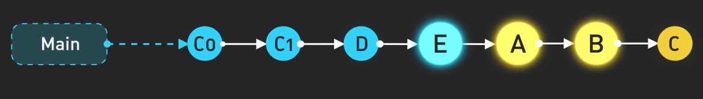
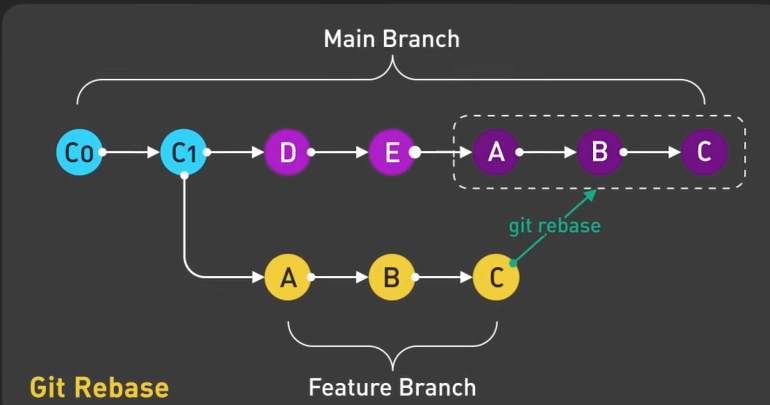

<pre>git rebase <base> </pre>
Rebase is one of two Git utilities designed to integrate changes from one branch onto another. 
Rebasing is the process of combining or moving a sequence of commits on top of a new base commit. 
Git rebase is the linear process of merging.

*Images are from link below*
[Git Rebase]([https://www.openai.com](https://youtu.be/0chZFIZLR_0?si=W0JWpNwrJIX1T84V)https://youtu.be/0chZFIZLR_0?si=W0JWpNwrJIX1T84V)
*This video explains git rebase very well*

